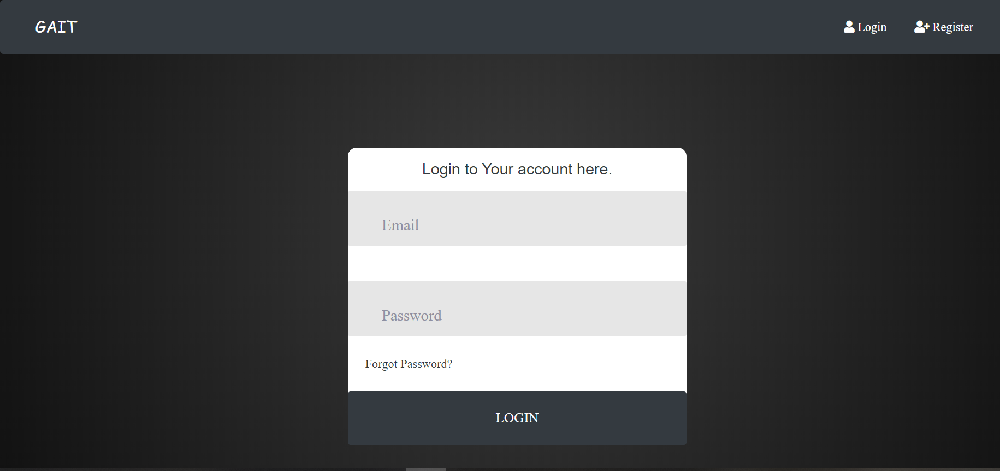
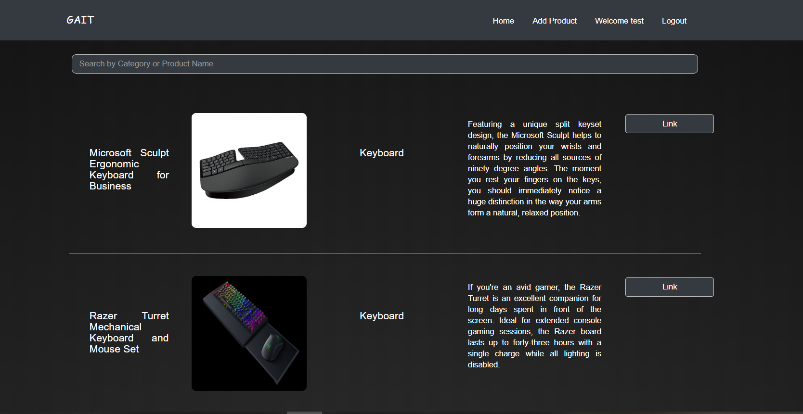
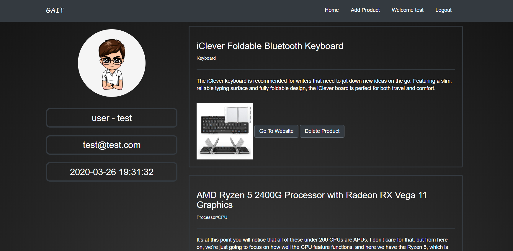

# GAIT
Gait is a gaming product review website. It is hosted in the following link: [http://gaitnsu.000webhostapp.com/](http://gaitnsu.000webhostapp.com/)

<!-- TABLE OF CONTENTS -->
## Table of Contents

* [About The Project](#about-the-project)
* [Project Description](#project-description)
  * [Architecture](#architecture)
  * [Front-end Developement](#front-end)
  * [Back-end Developement](#back-end)
* [Installations](#installations)

## About The Project

The objective of this project is to create a web application that helps the user to choose the right product according to their preference. This cuts down on the time-consuming work put into searching the whole internet and asking around for reviews that would ultimately affect your purchase decision. Gait hosts a vast collection of gaming products with their details and authentic reviews by users. It also includes ratings for every item. This allows other users to fill in their requirements, including the budget and discover the best option for them based on user reviews.

Moreover, there is an option for premium memberships. User can pay a subscription fee to get special features such as advertising their own product etc.
 

## Project Description
### Architecture

The frontend is a series of webpages developed with **HTML, CSS, JavaScript and Bootstrap.** The back end consists of a database to contain all the information such as product details, user account details etc. The database is be handled using **mysql and php**. A payment method has also been incorporated using **Stripe API** for premium membership of the users who would receive extra benefits.

### Front-end
The front end comprises of 4 pages in total. The homepage of the website, the registration page, the login page and the admin page forms the skeleton of the website. The following are a few snapshots of the website.
 
  
   

### Back-end

The back end handles much of the verification and authentication process. The database stores the information of the users and the products, including their details. The back end provides the password verification and ‘forgot password’ feature. The ER diagram below visually demonstrates the relations in the database.

## Installations
The project can be viewed in the link mentioned at the top or it can be cloned into a local computer. To set up the repository copy the project folder inside xaamp/htdocs and import the database file given inside Database/gait.sql and finally open index.php in the browser.
